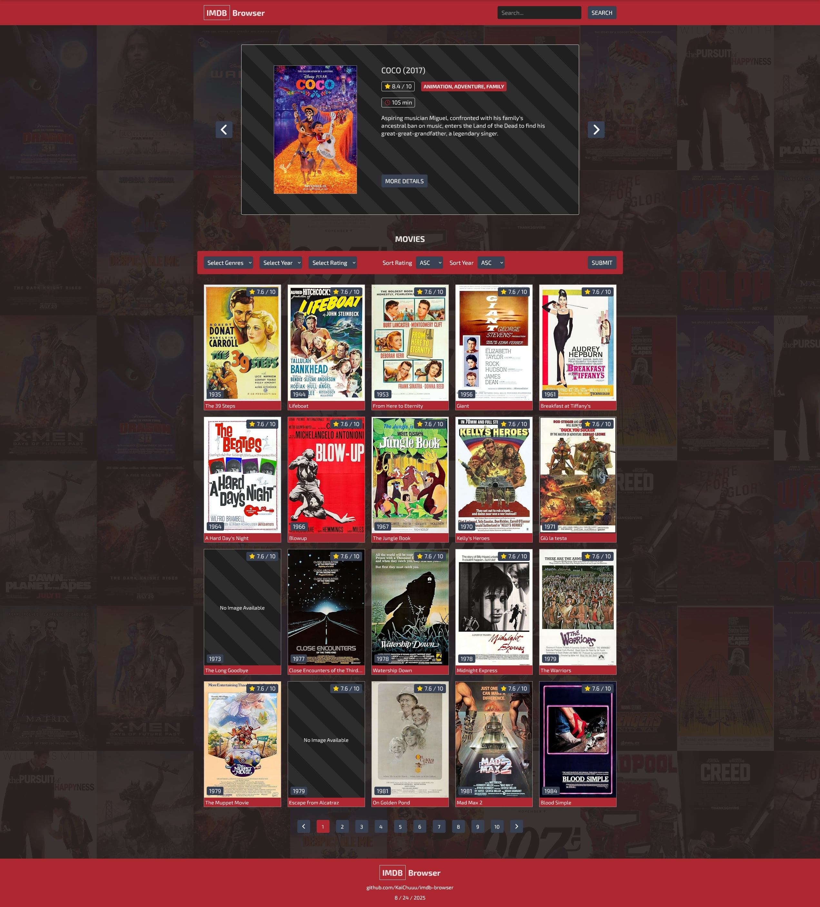

# IMDb Browser

A full-stack IMDb browser web application where you can look up details of the **Top 1000 IMDb movies and TV shows**.  

The dataset comes from [Kaggle – IMDb Top 1000 Movies and TV Shows](https://www.kaggle.com/datasets/harshitshankhdhar/imdb-dataset-of-top-1000-movies-and-tv-shows).  
I transformed this dataset into a PostgreSQL database hosted on **Supabase**, built a backend API with **Flask + SQLAlchemy**, and created a modern **React + Vite** frontend with **Tailwind CSS** and **TypeScript**.

**Live Website: [imdb-browser-app.vercel.app](https://imdb-browser-app.vercel.app)**

*Please note that render server may take 50 seconds to spin up.  
You will see mock data in the meantime. Please be patient, thank you!*

---

## Features

### Dataset & Database
- Source: IMDb Top 1000 movies dataset from Kaggle.
- Stored in a **PostgreSQL** database hosted on **Supabase**.
- Includes key details like title, release year, rating, genre, runtime, and more.

### Backend API
- Built using **Python Flask** and **SQLAlchemy**.
- Utilized **Blueprints** for modularity and cleaner route organization.
- Custom **SQL queries** to retrieve movie data.
- Provides endpoints for random movies, filtering, sorting, and searching.
- Hosted on **Render**.

### Frontend
- Built with **React + Vite**.
- **Tailwind CSS** for responsive styling and design.
- Written in **TypeScript, HTML, and CSS**.
- Modularized React components for cleaner code.
- Includes **mock data** for testing without the backend.
- Hosted on **Vercel**.

---

## Tech Stack
- **Frontend**: React, Vite, Tailwind CSS, TypeScript  
- **Backend**: Flask, SQLAlchemy, PostgreSQL  
- **Database**: Supabase (PostgreSQL)  
- **Hosting**: Render (backend), Vercel (frontend)  

## License
This project is for **educational purposes only** and is not affiliated with IMDb.

## Screenshots

  

